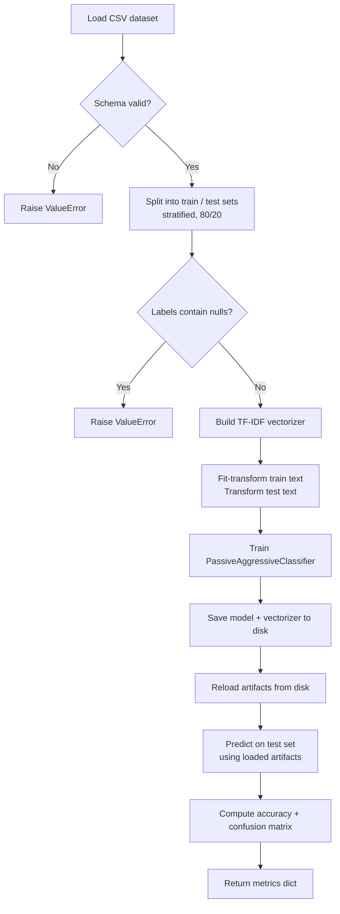

# Fake News Detection

[](https://www.python.org/)
[](LICENSE)
[](#testing)

A binary text classifier that labels news articles as **FAKE** or **REAL** using TF-IDF feature extraction and a Passive Aggressive linear classifier. The entire pipeline — data loading, training, artifact persistence, and evaluation — runs inside a single Jupyter notebook.

---

## Table of Contents

1. [Project Overview](#project-overview)
2. [Architecture Overview](#architecture-overview)
3. [System Flow](#system-flow)
4. [Data Model](#data-model)
5. [Core Modules](#core-modules)
6. [Dataset](#dataset)
7. [Configuration](#configuration)
8. [Security Considerations](#security-considerations)
9. [Setup & Installation](#setup--installation)
10. [Running the Application](#running-the-application)
11. [Testing](#testing)
12. [Limitations](#limitations)
13. [Future Improvements](#future-improvements)
14. [License](#license)

---

## Project Overview

This project implements a supervised machine-learning pipeline for fake news detection. Given a CSV dataset of labeled news articles, it:

- Loads and validates the dataset (schema checks, null handling, binary-file rejection).
- Splits data into train/test sets with stratified sampling.
- Converts article text to numerical features via TF-IDF vectorization.
- Trains a `PassiveAggressiveClassifier` with deterministic seeding.
- Persists the trained model and vectorizer to disk as a single pickle artifact.
- Reloads artifacts and evaluates predictions against held-out test data, producing accuracy and a confusion matrix.

All logic resides in `Fake_news_Detection.ipynb`. There is no separate backend, API server, or UI layer.

---

## Architecture Overview

The system is a single-notebook ML pipeline with two code cells:

| Component | Location | Responsibility |
|---|---|---|
| **Function definitions** | Cell 1 of `Fake_news_Detection.ipynb` | Nine pure functions + one frozen dataclass for configuration |
| **Execution flow** | Cell 2 of `Fake_news_Detection.ipynb` | Orchestrates the full pipeline top-to-bottom |
| **Test suite** | `tests/` directory (4 files) | pytest-based validation using a notebook-loader fixture |
| **Dataset** | `news/news.csv` | 6,335 labeled articles |
| **Dependencies** | `requirements.txt` | Five pinned packages |

There is no multi-service architecture, no web framework, and no agent/workflow system.

---

## System Flow

The notebook executes the following steps sequentially:



**Step-by-step detail:**

1. `load_dataset` reads `news/news.csv` and validates that columns `text` and `label` exist.
2. `split_dataset` fills null text with empty strings, guards against null labels, and performs an 80/20 stratified train-test split.
3. `build_vectorizer` creates a `TfidfVectorizer` with English stop-word removal and `max_df=0.7`.
4. `vectorize_text` fits the vectorizer on training text and transforms both splits into sparse matrices.
5. `train_model` fits a `PassiveAggressiveClassifier` (100 max iterations, seeded).
6. `save_model_artifacts` serializes the model and vectorizer into a single pickle file.
7. `load_model_artifacts` deserializes and validates the artifact types.
8. Predictions are generated from the **loaded** (not in-memory) model to verify the roundtrip.
9. `evaluate_model` computes accuracy and a confusion matrix.

---

## Data Model

### `ModelConfig` (frozen dataclass)

All pipeline parameters are centralized in a single immutable configuration object:

| Field | Type | Default | Purpose |
|---|---|---|---|
| `test_size` | `float` | `0.2` | Fraction of data reserved for testing |
| `random_state` | `int` | `7` | Seed for train-test split and classifier |
| `max_df` | `float` | `0.7` | TF-IDF maximum document frequency threshold |
| `max_iter` | `int` | `100` | Classifier training iteration limit |
| `stop_words` | `str` | `"english"` | Stop-word list for TF-IDF |

### Artifact file (`model_artifacts.pkl`)

A single pickle file containing a Python `dict` with two keys:

| Key | Type | Content |
|---|---|---|
| `"model"` | `PassiveAggressiveClassifier` | Trained classifier |
| `"vectorizer"` | `TfidfVectorizer` | Fitted TF-IDF vectorizer |

### Evaluation output

`evaluate_model` returns a `Dict[str, object]`:

| Key | Type | Content |
|---|---|---|
| `"accuracy"` | `float` | Fraction of correct predictions |
| `"confusion_matrix"` | `NDArray[np.int_]` | 2 × 2 confusion matrix |

---

## Core Modules

All functions are defined in Cell 1 of `Fake_news_Detection.ipynb`.

### `load_dataset(path: Path) -> pd.DataFrame`

| | |
|---|---|
| **Purpose** | Read a CSV file and validate its schema |
| **Input** | Filesystem path to CSV |
| **Output** | DataFrame with at least `text` and `label` columns |
| **Error handling** | `FileNotFoundError` for missing files; `ValueError` for invalid/binary files or missing required columns |

### `split_dataset(df: pd.DataFrame, config: ModelConfig) -> Tuple[Series, Series, Series, Series]`

| | |
|---|---|
| **Purpose** | Split data into train/test with stratification |
| **Input** | DataFrame + config |
| **Output** | `(x_train, x_test, y_train, y_test)` as pandas Series |
| **Behavior** | Fills null text with `""`, rejects null labels with `ValueError`, applies `stratify=labels` |

### `build_vectorizer(config: ModelConfig) -> TfidfVectorizer`

| | |
|---|---|
| **Purpose** | Create a configured TF-IDF vectorizer |
| **Input** | Config (uses `stop_words` and `max_df`) |
| **Output** | Unfitted `TfidfVectorizer` instance |

### `vectorize_text(vectorizer, x_train, x_test) -> Tuple[ndarray, ndarray]`

| | |
|---|---|
| **Purpose** | Fit-transform training text, transform test text |
| **Input** | Vectorizer + two text Series |
| **Output** | Two sparse matrices `(x_train_vec, x_test_vec)` |
| **Behavior** | Applies `fillna("").astype(str)` before vectorization; catches `ValueError`, `TypeError`, `AttributeError` |

### `train_model(x_train_vec, y_train, config) -> PassiveAggressiveClassifier`

| | |
|---|---|
| **Purpose** | Train the classifier |
| **Input** | Vectorized training data + labels + config |
| **Output** | Fitted classifier |
| **Behavior** | Uses `max_iter` and `random_state` from config |

### `evaluate_model(y_true, y_pred) -> Dict[str, object]`

| | |
|---|---|
| **Purpose** | Compute accuracy and confusion matrix |
| **Input** | Ground-truth labels + predicted labels |
| **Output** | Dict with `"accuracy"` (float) and `"confusion_matrix"` (2 × 2 array) |

### `save_model_artifacts(model, vectorizer, path) -> None`

| | |
|---|---|
| **Purpose** | Serialize trained model and vectorizer to a pickle file |
| **Input** | Fitted classifier, fitted vectorizer, output path |
| **Error handling** | `ValueError` on I/O failure |

### `load_model_artifacts(path) -> Tuple[PassiveAggressiveClassifier, TfidfVectorizer]`

| | |
|---|---|
| **Purpose** | Deserialize and validate a previously saved artifact |
| **Input** | Path to pickle file |
| **Output** | `(model, vectorizer)` |
| **Validation** | Checks payload is a dict, contains both keys, and both values are the expected types |
| **Error handling** | `FileNotFoundError` for missing file; `ValueError` for corrupted, malformed, or wrong-type artifacts |

---

## Dataset

**File:** `news/news.csv`

| Property | Value |
|---|---|
| Rows | 6,335 |
| Columns | `Unnamed: 0`, `title`, `text`, `label` |
| Label values | `FAKE` (3,164 rows), `REAL` (3,171 rows) |
| Text length | 1 – 115,848 characters (median ≈ 3,662) |
| Null values | None |

The pipeline uses only the `text` and `label` columns. The `title` and index columns are ignored.

---

## Configuration

All tunable parameters are controlled through the `ModelConfig` dataclass. To change defaults, modify the instantiation in Cell 2:

```python
config = ModelConfig(test_size=0.3, max_iter=200)
```

The dataclass is frozen — values cannot be mutated after creation.

---

## Security Considerations

- **Pickle deserialization:** `load_model_artifacts` uses `pickle.load`, which can execute arbitrary code if given a malicious file. The function includes a docstring warning. Only load artifact files that you produced locally.
- **No network exposure:** The notebook runs locally. There is no web server, API, or remote endpoint.
- **No authentication:** Not applicable — there is no multi-user or networked component.
- **No input sanitization beyond schema checks:** `load_dataset` validates column presence and file readability, but does not sanitize article text content.

---

## Setup & Installation

**Prerequisites:** Python 3.11 or later.

```bash
# Clone the repository
git clone https://github.com/pypi-ahmad/Fake_News_Detection.git
cd Fake_News_Detection

# Create and activate a virtual environment
python -m venv .venv

# Windows
.venv\Scripts\activate
# macOS / Linux
source .venv/bin/activate

# Install dependencies
pip install -U pip
pip install -r requirements.txt
```

### Pinned dependencies (`requirements.txt`)

| Package | Version |
|---|---|
| numpy | 2.1.4 |
| pandas | 2.2.3 |
| scikit-learn | 1.5.2 |
| jupyter | 1.1.1 |
| ipykernel | 6.29.5 |

---

## Running the Application

```bash
jupyter notebook Fake_news_Detection.ipynb
```

Run both cells in order. The notebook will:

1. Load and validate `news/news.csv`.
2. Train a TF-IDF + Passive Aggressive classifier.
3. Save the model and vectorizer to `model_artifacts.pkl`.
4. Reload artifacts from disk.
5. Predict on the test set using the reloaded model.
6. Display a `dict` containing `accuracy` and `confusion_matrix`.

The generated `model_artifacts.pkl` file is listed in `.gitignore` and is not committed.

---

## Testing

**Framework:** pytest

**Test files:**

| File | Tests | Scope |
|---|---|---|
| `tests/test_unit_functions.py` | 12 | Unit tests for each pipeline function |
| `tests/test_integration_pipeline.py` | 3 | End-to-end pipeline flows |
| `tests/test_ml_and_edge_cases.py` | 8 | Artifact roundtrip, null labels, corrupted files |
| `tests/conftest.py` | — | Shared fixtures (notebook loader, sample data) |

**How tests load notebook code:** `conftest.py` parses the notebook JSON, extracts Cell 1 source, and `exec()`s it into a `SimpleNamespace` exposed via a session-scoped `nb` fixture.

```bash
# Run all 23 tests
python -m pytest -q

# Verbose output
python -m pytest -v
```

**Coverage areas:**
- Config defaults
- Dataset loading (success, missing file, missing columns, binary file)
- Dataset splitting (partitions, stratification, null labels, invalid schema)
- Vectorization (shapes, empty input, null text)
- Training (classifier type, mismatched shapes)
- Evaluation (metric structure, mismatched lengths)
- Artifact persistence (roundtrip equality, missing file, corrupted file)
- End-to-end pipeline with the real dataset (200-row subset)

---

## Limitations

These are factual constraints of the current implementation:

1. **No web interface or API.** The only entry point is the Jupyter notebook.
2. **Pickle-based persistence.** Model artifacts use `pickle`, which is not portable across Python versions and carries deserialization risks.
3. **No cross-validation.** Training uses a single 80/20 split. There is no k-fold cross-validation or hyperparameter search.
4. **No text preprocessing beyond TF-IDF.** The pipeline does not perform lowercasing, stemming, lemmatization, or other NLP preprocessing — it relies entirely on the `TfidfVectorizer` defaults plus English stop-word removal.
5. **Labels are treated as-is.** The dataset labels are strings (`"FAKE"` / `"REAL"`). The code does not encode them to integers; it passes them directly to scikit-learn, which handles string labels internally.
6. **Single model type.** Only `PassiveAggressiveClassifier` is used. There is no model comparison or ensemble.
7. **No logging to file.** `logging.basicConfig(level=logging.INFO)` writes to stderr only.

---

## Future Improvements

Based on patterns present in the code that suggest natural extension points:

- **Replace pickle with `joblib` or `skops`** for safer, more portable model serialization.
- **Add cross-validation** by extending `ModelConfig` with a `cv_folds` parameter and using `cross_val_score`.
- **Extract notebook logic into a Python module** to enable direct imports and CLI usage instead of relying on `exec()` in tests.
- **Add text preprocessing steps** (lowercasing, stemming) as configurable options in `ModelConfig`.
- **Compare multiple classifiers** by parameterizing the model class alongside existing config fields.

---

## Project Structure

```
Fake_News_Detection/
├── Fake_news_Detection.ipynb    # Full pipeline (definitions + execution)
├── news/
│   └── news.csv                 # 6,335 labeled articles
├── tests/
│   ├── conftest.py              # Notebook loader fixture + sample data
│   ├── test_unit_functions.py   # 12 unit tests
│   ├── test_integration_pipeline.py  # 3 integration tests
│   └── test_ml_and_edge_cases.py     # 8 edge-case tests
├── requirements.txt             # Pinned dependencies
├── TEST_REPORT.md               # Audit and test evidence report
├── .gitignore
├── LICENSE                      # MIT
└── README.md
```

---

## License

MIT. See [LICENSE](LICENSE).
